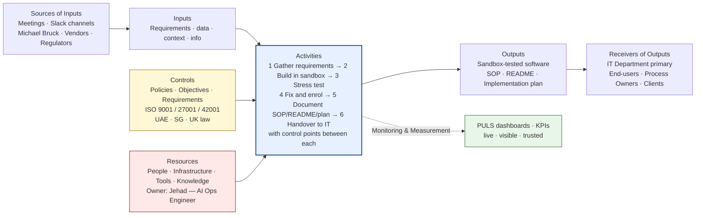

# 04-FORMAL-RESPONSE

_Extracted from `Documents/janus-puls-onboarding/04-FORMAL-RESPONSE.md` on 2026-05-14._

# [[puls-first-voice|PULS First Voice]] — AI Operations Engineer

**Submitted by:** Jehad — AI Operations Engineer, Janus Digital
**IMS processes covered:** C1 AI System Design & Development · C2 Software Development & Release · S2 IT Infrastructure & Data Governance
**Format:** ISO 9001:2015 Figure 1 — Schematic representation of a single process (per slide 8 of the IMS Development Programme deck)

---

## 1. Process schematic — primary diagram

```
                            ┌─────────────────────────────────┐
                            │           CONTROLS              │
                            │  Policies · Objectives ·         │
                            │  Requirements (ISO 9001 / 27001 │
                            │  / 42001 · UAE · SG · UK law)   │
                            └────────────────┬────────────────┘
                                             │
                                             ▼
┌──────────────┐   ┌────────────┐   ┌────────────────────────────────────────┐   ┌──────────────┐   ┌──────────────┐
│   SOURCES    │   │            │   │              ACTIVITIES                 │   │              │   │  RECEIVERS   │
│   OF INPUTS  │──▶│   INPUTS   │──▶│  ┌──────┐    ┌──────┐    ┌──────┐      │──▶│   OUTPUTS    │──▶│  OF OUTPUTS  │
│              │   │            │   │  │  1   │CP─▶│  2   │CP─▶│  3   │CP    │   │              │   │              │
│ Meetings ·   │   │ Requirements│  │  │Reqs  │    │Build │    │Stress│      │   │ Sandbox-     │   │ IT Dept      │
│ Slack        │   │ data ·     │   │  │gather│    │in    │    │test  │      │   │ tested       │   │ (deploys     │
│ channels ·   │   │ context    │   │  │      │    │sand- │    │      │      │   │ software ·   │   │ company-     │
│ Michael      │   │ info       │   │  └──────┘    │ box  │    └──────┘      │   │              │   │ wide) ·      │
│ Bruck ·      │   │            │   │      ▼       └──────┘        ▼          │   │ SOP ·        │   │ End-users ·  │
│ vendors ·    │   │            │   │  ┌──────┐    ┌──────┐    ┌──────┐    │   │ README ·     │   │ Process      │
│ regulators   │   │            │   │  │  4   │CP─▶│  5   │CP─▶│  6   │    │   │ Implementa-  │   │ Owners ·     │
│              │   │            │   │  │ Fix  │    │Docu- │    │Hand- │    │   │ tion plan    │   │ Clients      │
│              │   │            │   │  │+enrol│    │ment  │    │ over │    │   │              │   │ (when        │
│              │   │            │   │  └──────┘    └──────┘    └──────┘    │   │              │   │ applicable)  │
│              │   │            │   │                                        │   │              │   │              │
│              │   │            │   │  ⏵ Monitoring & Measurement · KPIs    │   │              │   │              │
└──────────────┘   └────────────┘   └────────────────────┬───────────────────┘   └──────────────┘   └──────────────┘
                                                         ▲
                                                         │
                            ┌────────────────────────────┴────────────────────────────┐
                            │                       RESOURCES                          │
                            │   People · Infrastructure · Tools · Knowledge            │
                            │   (Process Owner: Jehad — AI Ops Engineer)              │
                            └──────────────────────────────────────────────────────────┘

Documented evidence ─▶ Records retained as objective evidence for audit and continual improvement
                       (Stored in Notion · monitored in PULS · auditable from any jurisdiction)

CP = Control Point     1→6 = sub-processes (defined below)
```

---

## 2. Same diagram in Mermaid (for Notion / GitHub / docs)



---

## 3. Box-by-box detail

### ① Sources of Inputs

| Type | Source |
|---|---|
| **Internal — meetings** | Department / team kickoff and requirements meetings |
| **Internal — Slack** | Slack channels for async requests, ideas, and support questions |
| **Internal — leadership** | [[michael-bruck|Michael Bruck]] (AI Projects lead) — strategic direction, approval |
| **External — vendors** | [[anthropic|Anthropic]] (Claude) · [[openai|OpenAI]] · Vercel · [[hostinger|Hostinger]] · Neon · Airwallex · n8n |
| **External — regulators** | UAE · Singapore (MAS / IMDA) · UK (ICO / FCA) — when jurisdiction-specific |
| **Other interested parties** | Internal auditors · Certification body |

### ② Inputs

| Category | Examples |
|---|---|
| **Requirements** | Specs gathered from meetings or Slack threads — must be complete before build starts |
| **Constraints** | Existing system / stack / infrastructure / budget |
| **Access** | Credentials, third-party API keys, sandbox environments |
| **Direction** | Strategic priorities and approvals from Michael / leadership |

### ③ Activities (real flow — 6 steps)

| # | Sub-process | Description | Control point on exit |
|---|---|---|---|
| **1** | **Gather requirements** | Meetings or Slack threads until scope is complete | Requirements signed off · no build starts before this gate |
| **2** | **Build in sandbox** | Develop the feature / system in an isolated environment | Working build deployed to sandbox |
| **3** | **Stress test** | Try to break it — functionality, UI/UX, security, APIs, stability | All five test areas pass; weaknesses logged |
| **4** | **Fix & enrol** | Patch what testing surfaced; finalise the build | All known issues resolved or accepted |
| **5** | **Document** | Write SOP, README, implementation plan | All three documents complete |
| **6** | **Handover to IT** | IT department reviews and accepts; deploys company-wide | IT acceptance recorded · production deploy executed |

### ④ Outputs

| Output | Form |
|---|---|
| **Sandbox-tested software** | Working feature / system / automation / AI agent — verified by stress testing |
| **SOP** | Standard Operating Procedure document for the new system |
| **README** | Setup and usage documentation |
| **Implementation plan** | Step-by-step deployment plan handed to IT |
| **Documented evidence** | Test logs · security check results · API behaviour records · access logs |
| **Decisions** | Tooling choices · architecture approvals · vendor selections |

### ⑤ Receivers of Outputs

| Type | Receiver |
|---|---|
| **Primary** | IT department — receives the handover package and deploys the system company-wide |
| **Secondary (internal)** | End-users in the requesting department / team |
| **Subsequent processes** | C5 Service Delivery & Operations · M3 Performance Monitoring & KPI · M4 Internal Audit · M5 Management Review & Corrective Action |
| **External (when applicable)** | Clients · partners · certification body (audit evidence) |

### ⑥ Controls & check points

| Stage | Control |
|---|---|
| **Before build (after step 1)** | Requirements complete and confirmed — no build starts without signed-off scope |
| **Build (step 2)** | Done in isolated sandbox — never directly in production |
| **Stress test (step 3)** | Functionality coverage · UI/UX walkthrough · security checks · API behaviour under load · attempts to break the system |
| **Pre-handover (after step 5)** | SOP + README + implementation plan must all exist before handover |
| **Handover gate (step 6)** | IT department reviews and accepts before company-wide deploy |
| **AI-specific (42001)** | AI Impact Assessment when the build introduces a new AI system · entry added to AI Systems Register |

### ⑦ Resources

| Resource | Detail |
|---|---|
| **Process Owner** | Jehad — AI Operations Engineer (accountable) |
| **People** | AI Projects team (lead: Michael Bruck) · Process Owners across the 20 IMS processes |
| **Infrastructure** | Hostinger VPS (Ubuntu 24.04, Docker) · Vercel · Neon Postgres · Cloudflare · [[godaddy|GoDaddy]] |
| **AI tools** | Claude AI · OpenAI · [[claude-code|Claude Code]] · Codex · Antigravity (1,328+ [[gemini|Gemini]] skill modules) · AI Gateway · 22 custom Claude Code skills |
| **Dev tools** | Cursor / VS Code · Next.js 15 · React · TypeScript · Tailwind · shadcn/ui · Drizzle ORM · n8n |
| **Productivity** | Notion · [[linear|Linear]] · Slack · [[github|GitHub]] |
| **Knowledge** | [[obsidian|Obsidian]] Brain (personal [[knowledge-graph|knowledge graph]]) · ISO standards · vendor documentation |

### ⑧ Monitoring & Measurement (current state + asks)

I don't currently track formal KPIs. My quality bar is **"can I break it?"** — I try to find weaknesses myself before users do. The five test areas:

| Test area | What I check |
|---|---|
| **Functionality** | Does every feature work under expected load? |
| **UI / UX** | Is it usable, accessible, and intuitive? |
| **Security** | Does it survive standard attack patterns and API abuse? |
| **APIs** | Response times, error rates, edge cases under load |
| **Stability** | Does it stay up under sustained use? |

If I can't break it across those five areas, it's ready for handover.

**Open ask to ISO lead:** I'd appreciate help defining formal KPIs for these criteria — pass/fail thresholds, measurement frequency, target values — so the test phase produces something the PULS dashboard can monitor automatically. Suggested KPI candidates the dashboard could track once defined:

| Candidate KPI | Possible source |
|---|---|
| Test-area pass rate (5/5 required for handover) | Manual log → Linear → PULS |
| Critical security findings at handover | Security scan output |
| Time from requirements gathered to IT handover | Linear cycle data |
| Post-handover defect rate (issues found by IT or users) | Linear issue tracker |
| AI Systems Register coverage (% of deployed AI tools with entries) | Notion / register audit |

---

## 4. PULS tooling overlay — how each box of the schematic is implemented

```
   SOURCES          INPUTS          ACTIVITIES         OUTPUTS         RECEIVERS
      │                │                 │                │                │
      ▼                ▼                 ▼                ▼                ▼
   ┌──────┐       ┌────────┐      ┌────────────┐    ┌────────┐       ┌────────┐
   │Notion│       │  n8n   │      │  Next.js + │    │ Notion │       │ Slack  │
   │  +   │       │ flows  │      │  GitHub +  │    │  +     │       │   +    │
   │Linear│       │   +    │      │  Vercel +  │    │ Linear │       │ Email  │
   │      │       │webhooks│      │  Hostinger │    │   +    │       │   +    │
   │      │       │   +    │      │     VPS    │    │  PULS  │       │ PULS   │
   │      │       │AI feeds│      │            │    │   DB   │       │ portal │
   └──────┘       └────────┘      └────────────┘    └────────┘       └────────┘
                                        ▲
                                        │
                              ┌──────────────────┐
                              │   Claude API +   │
                              │    AI Gateway    │
                              │  (predictive +   │
                              │  governance)     │
                              └──────────────────┘
```

**System of Record:** Notion (per deck slide 6) · **Automation:** n8n on Hostinger VPS (already live) · **Build/run platform:** Next.js + Vercel + Neon · **CAPA / Audit:** Linear · **Predictive layer:** Claude API · **Comms:** Slack · **All KPIs visible in:** PULS dashboard.

---

## 5. Cover note (short — paste above the diagram when you send)

Hi [ISO LEAD NAME],

Following the IMS Development Programme deck, I've mapped the AI Operations Engineer role onto the ISO 9001:2015 Figure 1 schematic shown on slide 8. The full process definition is below — sources, inputs, activities (with control points), outputs, receivers, controls, resources and KPIs — covering my contribution to **C1 AI System Design & Development**, **C2 Software Development & Release** and **S2 IT Infrastructure & Data Governance**.

The "PULS tooling overlay" at the end shows which existing tool implements each box of the schematic. I've kept it deliberately to tools we already run in production (Notion + n8n + Vercel + Hostinger VPS + Linear + Claude) so we can stand up a PULS skeleton in days rather than weeks.

Three open questions before we lock anything in:

1. Do you want one schematic per IMS process, or one per role? (I've done role-based here; happy to break it out per process if that's how the 20 documents will be structured.)
2. Process Owner assignment for C1 / C2 / S2 — is that landing on me, or splitting with Michael?
3. Should the AI Systems Register (42001) follow this same Figure 1 schematic for each registered AI system, or a different schema?

Happy to walk through this in a 30-min sync.

Best,
Jehad

---

## Send-checklist

- [ ] Replace `[ISO LEAD NAME]`
- [ ] Confirm with Michael before volunteering for Process Owner of C1/C2/S2
- [ ] Pick delivery format: Notion page (Mermaid renders natively) · email + PDF export · Slack post with code-block ASCII
- [ ] If you want this as a proper visual instead of ASCII, paste the Mermaid block into Notion or https://mermaid.live and export PNG/SVG
