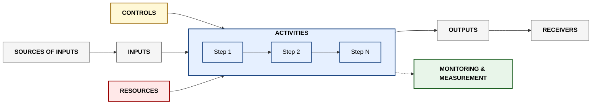

<!-- jb:project-callout -->
> Part of [[janus-puls-onboarding|Janus PULS Onboarding]] — automatically linked by /janus-brain.


# iso-9001-figure-1

> Part of [[janus-puls-onboarding|Janus PULS Onboarding]] — captured by /janus-brain.

_Extracted from `Documents/janus-puls-onboarding/skills/ims-enrolment/references/iso-9001-figure-1.md` on 2026-05-14._

# ISO 9001:2015 Figure 1 — The Schematic Shape

> Every IMS process document at Janus follows this exact shape. Memorise it — once it clicks, the 7 sections of any process document make obvious sense.

## The diagram

```
                            ┌─────────────────────────────────┐
                            │           CONTROLS              │
                            │  Policies · Objectives ·         │
                            │  Requirements                    │
                            └────────────────┬────────────────┘
                                             │
                                             ▼
┌──────────────┐   ┌────────────┐   ┌────────────────────────────────────────┐   ┌──────────────┐   ┌──────────────┐
│   SOURCES    │   │            │   │              ACTIVITIES                 │   │              │   │  RECEIVERS   │
│   OF INPUTS  │──▶│   INPUTS   │──▶│  Step 1 → Step 2 → Step 3 → ... → End  │──▶│   OUTPUTS    │──▶│  OF OUTPUTS  │
│              │   │            │   │                                        │   │              │   │              │
│ Predecessor  │   │ Triggers · │   │  ⏵ Monitoring & Measurement · KPIs    │   │ Products ·   │   │ Subsequent   │
│ processes &  │   │ data ·     │   │                                        │   │ services ·   │   │ processes &  │
│ external     │   │ info       │   │                                        │   │ records      │   │ external     │
│ parties      │   │            │   │                                        │   │              │   │ parties      │
└──────────────┘   └────────────┘   └────────────────────┬───────────────────┘   └──────────────┘   └──────────────┘
                                                         ▲
                                                         │
                            ┌────────────────────────────┴────────────────────────────┐
                            │                       RESOURCES                          │
                            │   People · Infrastructure · Tools · Knowledge            │
                            └──────────────────────────────────────────────────────────┘
```

## In plain English

A process is just **work that has a beginning, a middle, and an end**. ISO 9001:2015 Figure 1 names every part of that work explicitly so any auditor (or new employee) can understand it without asking.

- **Sources of inputs** = who/what kicks the work off
- **Inputs** = what actually arrives (the trigger event, the data, the request)
- **Activities** = what happens between input arriving and output leaving — the actual *work*
- **Outputs** = what gets produced
- **Receivers of outputs** = who consumes what was produced
- **Controls** = the rules, policies, and quality gates that govern how the activities happen
- **Resources** = what's needed to do the activities (people, tools, knowledge, budget)
- **Monitoring & measurement** = the KPIs that prove the activities are working

The diagram is **the same shape at every level**:

- For the **whole department** (parent process) — Activities are the major chapters of what the department does
- For **one activity** (sub-process) — Activities are the step-by-step procedure within that single activity
- For **one task** (operational level) — Activities are the individual actions a single person takes

## Why this shape matters

1. **Auditor familiarity** — every ISO auditor recognises this shape immediately
2. **Department alignment** — every department uses the same template, so an auditor inspecting Janus sees consistency
3. **Forces clarity** — you can't have a process without inputs, outputs, controls, and resources. If you can't fill in a section, your process isn't really defined
4. **Drillable** — the same shape works at parent process level, sub-process level, and individual task level

## Mermaid template (paste this into Notion or [[github|GitHub]] for an interactive version)



## Common confusions

| Confusion | Clarification |
|---|---|
| "What's the difference between Controls and Resources?" | Controls = the rules. Resources = the things. A control might say "every release must have a peer review." The resource is the reviewer and the review tool. |
| "What's the difference between Inputs and Sources?" | Sources = the *origin* (who/what). Inputs = the *content* (what's actually transmitted). A source might be "the HR team's Slack channel." The input is "the new-hire request message itself." |
| "Are Activities the workflow or the procedure?" | Activities are the workflow — the named steps. The procedure (the how-to) is referenced from each activity but lives in supporting documentation. |
| "What if my Activities are non-sequential or parallel?" | That's fine. Draw the diagram with parallel branches. ISO doesn't require [[linear|linear]] sequences. |

## Source

This is slide 8 of Simon's IMS Development Programme deck. The full deck is the canonical reference. The schematic is **non-negotiable** — every process document must follow this shape.
