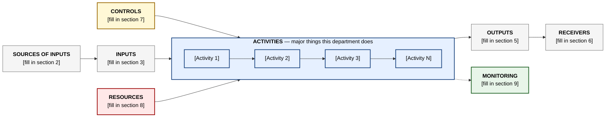

# parent-department-process

_Extracted from `Documents/janus-puls-onboarding/skills/ims-enrolment/templates/parent-department-process.md` on 2026-05-14._

# [DEPARTMENT NAME] — Parent Process Document

**Process Owner:** [Named C-level / department head — required]
**Date drafted:** [YYYY-MM-DD]
**Status:** Draft v0.1 — pending Simon's review
**Maps to IMS process code:** [Simon assigns — leave blank]
**Related ISO clauses:** ISO 9001:2015 §[X] · ISO/IEC 27001:2022 §[X] · ISO/IEC 42001:2023 §[X]

---

## 0. About this document

This is the **parent process document** for the [Department Name] at Janus Digital. It describes how the department functions **as a whole** in the ISO 9001:2015 Figure 1 schematic shape (Sources → Inputs → Activities → Outputs → Receivers, with Controls + Resources). Each major activity listed in section 3 has its own **sub-process document** that drills into the detail.

This document is intended for inclusion in the Janus IMS under IMS-PRC-XXX-NNN (Simon assigns the code).

---

## 1. Process schematic — Figure 1

---

## 2. Sources of inputs

> *Who or what triggers the work of this department? List the internal teams, external parties, regulators, and scheduled events that send work into your department.*

| Type | Source |
|---|---|
| **Internal — predecessor processes** | [e.g. Strategic Leadership · Risk Management · Customer Onboarding] |
| **Internal — meetings / channels** | [e.g. Department kickoff meetings · Slack channels · standups] |
| **External — clients** | [e.g. Active clients · prospect clients] |
| **External — partners / vendors** | [e.g. Specific named partners or vendor categories] |
| **External — regulators** | [e.g. UAE · Singapore (MAS / IMDA) · UK (ICO / FCA)] |
| **Other interested parties** | [e.g. Internal auditors · Certification body] |

---

## 3. Inputs

> *Concretely — what flows into your department? Triggers, data, requirements, resources requested. Each input should map to a source from section 2.*

| Category | Examples |
|---|---|
| **Triggers** | [e.g. New feature request · incident · scheduled review · regulatory change] |
| **Data** | [e.g. Operational telemetry · client requests · vendor reports] |
| **Information** | [e.g. Strategic objectives · ISO clauses · contractual obligations] |
| **Resources requested** | [e.g. Budget allocation · team capacity · third-party licences] |

---

## 4. Activities — the major things this department does

> *This is the most important section of the parent document. List the 3-10 major activities your department performs. Each activity will get its own **sub-process document** (sub-process.md) describing it in detail.*
> *Order them roughly by sequence (what comes first to last in a typical workflow) where applicable.*

| # | Activity | Lead | Sub-process doc |
|---|---|---|---|
| 1 | [Activity name] | [Activity owner] | sub-process-[slug].md |
| 2 | [Activity name] | [Activity owner] | sub-process-[slug].md |
| 3 | [Activity name] | [Activity owner] | sub-process-[slug].md |
| 4 | [Activity name] | [Activity owner] | sub-process-[slug].md |
| ... | ... | ... | ... |

**Each activity above will be documented as a separate sub-process file.** See `sub-process.md` template.

---

## 5. Outputs

> *What does your department actually produce? Deliverables, decisions, records, services, products.*

| Output | Form |
|---|---|
| [Output name] | [e.g. Document · service · record · decision · KPI signal] |
| ... | ... |

---

## 6. Receivers of outputs

> *Who consumes what you produce? Same categories as sources, but reversed — internal subsequent processes, external clients/partners, regulators when applicable.*

| Type | Receiver |
|---|---|
| **Subsequent processes (internal)** | [List the internal processes/departments that receive your outputs] |
| **Subsequent processes (external)** | [Active clients · partners · regulators] |
| **Other** | [Internal audit · certification body · top management] |

---

## 7. Controls and check points

> *Where in the activities (section 4) does quality get checked? What gates exist? Who approves what? When does work stop and wait for review?*

| Stage / control | What is checked | Who decides |
|---|---|---|
| [Pre-activity] | [e.g. Requirements complete · risk assessment signed] | [Owner] |
| [Mid-activity] | [e.g. Peer review · automated test · security scan] | [Owner] |
| [Post-activity] | [e.g. Acceptance criteria met · KPIs within target] | [Owner] |
| [Cross-cutting] | [e.g. ISO 42001 AI Impact Assessment for AI-touching work] | [Owner] |

---

## 8. Resources

> *People, infrastructure, tools, knowledge, budget. This is what the department needs to function.*

| Resource | Detail |
|---|---|
| **Process Owner** | [Named C-level — single point of accountability] |
| **People** | [Roles · team size · reporting lines] |
| **Infrastructure** | [Buildings · servers · hardware · network] |
| **Tools & systems** | [Software, AI tools, platforms — just list them. The AI department maintains the AI Systems Register ([[linear|Linear]] AIR) and verifies every AI tool has been Gate 1-4 evaluated before reaching other departments.] |
| **Knowledge** | [Internal knowledge sources · external sources · standards followed] |
| **Budget** | [Annual budget envelope · cost categories] |

---

## 9. Monitoring & measurement (KPIs)

> *How do you know the department is performing well? Each KPI should have a target value, measurement frequency, and a source.*

| KPI | Target | Source | Frequency |
|---|---|---|---|
| [KPI name] | [Target value] | [Where measured] | [Daily / weekly / monthly / quarterly] |
| ... | ... | ... | ... |

> If the department doesn't currently have formal KPIs, that is acceptable for v0.1 — note: *"KPIs to be defined in collaboration with Simon (ISO Lead) — proposed measurement areas above."*

---

## 10. Departmental scope statement

> *One paragraph: what is in scope for this department, what is out of scope, and what is shared with other departments. This prevents auditor confusion later.*

[Write 3-5 sentences describing the department's scope.]

---

## 11. Related sub-process documents

For each activity in section 4, the detailed sub-process document is at:

- [Activity 1] — `sub-process-[slug-1].md`
- [Activity 2] — `sub-process-[slug-2].md`
- [Activity 3] — `sub-process-[slug-3].md`
- ...

---

## 12. Open items for Simon (ISO Lead)

> *List any open questions, ambiguities, or decisions that block this document from being finalised. Each item should have decision-needed, why-blocking, and who-answers.*

1. **[Open item title]** — [decision needed] / [why it's blocking] / [who answers]
2. ...

---

## Change log

| Version | Date | Change | By |
|---|---|---|---|
| v0.1 | [YYYY-MM-DD] | Initial draft via `/ims-enrolment` | [Department head] |

---

*This document was drafted using the `/ims-enrolment` skill in Claude Desktop. AI Department worked example is available in `examples/ai-department/parent-process.md` of the skill bundle.*
