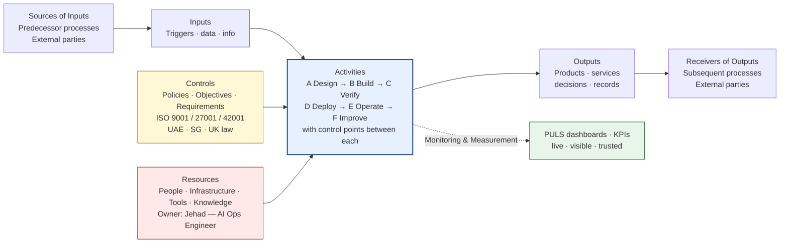

# puls-response-to-iso-lead

_Extracted from `Desktop/puls-response-to-iso-lead.md` on 2026-05-14._

# PULS First Voice — AI Operations Engineer

**Submitted by:** Jehad — AI Operations Engineer, Janus Digital
**IMS processes covered:** C1 AI System Design & Development · C2 Software Development & Release · S2 IT Infrastructure & Data Governance
**Format:** ISO 9001:2015 Figure 1 — Schematic representation of a single process (per slide 8 of the IMS Development Programme deck)

---

## 1. Process schematic — primary diagram

```
                            ┌─────────────────────────────────┐
                            │           CONTROLS              │
                            │  Policies · Objectives ·         │
                            │  Requirements (ISO 9001 / 27001 │
                            │  / 42001 · UAE · SG · UK law)   │
                            └────────────────┬────────────────┘
                                             │
                                             ▼
┌──────────────┐   ┌────────────┐   ┌────────────────────────────────────────┐   ┌──────────────┐   ┌──────────────┐
│   SOURCES    │   │            │   │              ACTIVITIES                 │   │              │   │  RECEIVERS   │
│   OF INPUTS  │──▶│   INPUTS   │──▶│  ┌──────┐    ┌──────┐    ┌──────┐      │──▶│   OUTPUTS    │──▶│  OF OUTPUTS  │
│              │   │            │   │  │  A   │CP─▶│  B   │CP─▶│  C   │CP    │   │              │   │              │
│ Predecessor  │   │ Triggers · │   │  │Design│    │Build │    │Verify│      │   │ Products ·   │   │ Subsequent   │
│ processes &  │   │ data ·     │   │  └──────┘    └──────┘    └──────┘      │   │ services ·   │   │ processes &  │
│ external     │   │ info       │   │      ▼          ▼          ▼          │   │ decisions ·  │   │ external     │
│ parties      │   │            │   │  ┌──────┐    ┌──────┐    ┌──────┐    │   │ records      │   │ parties      │
│              │   │            │   │  │  D   │CP─▶│  E   │CP─▶│  F   │    │   │              │   │              │
│              │   │            │   │  │Deploy│    │Operate│   │Improve│   │   │              │   │              │
│              │   │            │   │  └──────┘    └──────┘    └──────┘    │   │              │   │              │
│              │   │            │   │                                        │   │              │   │              │
│              │   │            │   │  ⏵ Monitoring & Measurement · KPIs    │   │              │   │              │
└──────────────┘   └────────────┘   └────────────────────┬───────────────────┘   └──────────────┘   └──────────────┘
                                                         ▲
                                                         │
                            ┌────────────────────────────┴────────────────────────────┐
                            │                       RESOURCES                          │
                            │   People · Infrastructure · Tools · Knowledge            │
                            │   (Process Owner: Jehad — AI Ops Engineer)              │
                            └──────────────────────────────────────────────────────────┘

Documented evidence ─▶ Records retained as objective evidence for audit and continual improvement
                       (Stored in Notion · monitored in PULS · auditable from any jurisdiction)

CP = Control Point     A→F = sub-processes (defined below)
```

---

## 2. Same diagram in Mermaid (for Notion / GitHub / docs)



---

## 3. Box-by-box detail

### ① Sources of Inputs

| Type | Source |
|---|---|
| **Predecessor processes (internal)** | M1 Strategic Leadership & IMS Planning · M2 Integrated Risk Management · C3 Partner Enablement & Certification · C4 Customer Onboarding & Activation · C7 Incident Management · S3 Legal Compliance & Contract Management |
| **External — clients** | AirWallex platform end-users (Dubai HQ + branches) · client building-data feeds |
| **External — partners / vendors** | Anthropic (Claude) · Vercel · Hostinger · Neon · Airwallex (financial APIs) · n8n |
| **External — regulators** | UAE (HQ jurisdiction) · Singapore (MAS / IMDA) · UK (ICO / FCA) · ISO/IEC standards bodies |
| **Other interested parties** | Internal auditors · Certification body |

### ② Inputs

| Category | Examples |
|---|---|
| **Triggers** | New feature request · incident · regulatory change · audit finding · scheduled review |
| **Data** | Operational telemetry from AirWallex platform · LLM usage logs · n8n execution logs · customer building-performance data |
| **Information** | Strategic objectives · KPI targets · risk register entries · ISO clauses · jurisdiction-specific legal requirements · vendor changelogs |
| **Resources requested** | Budget allocation · team capacity · infrastructure credentials · third-party licences |

### ③ Activities (sub-processes A → F)

| # | Sub-process | Description | Control point on exit |
|---|---|---|---|
| **A** | **Design** | Architecture, security review, AI impact assessment (42001), data classification | Design review approved · AI Impact Assessment signed |
| **B** | **Build** | Code, configure, integrate, document | Peer review passed · automated tests green · security scan clean |
| **C** | **Verify** | Test, eval AI outputs, validate against requirements | Acceptance criteria met · prompt eval pass rate ≥ threshold |
| **D** | **Deploy** | CI/CD promotion through dev → staging → prod | Deployment record created · rollback path verified |
| **E** | **Operate** | Run, monitor, alert, support | Health checks green · KPIs within target · no drift breach |
| **F** | **Improve** | Post-incident review · retro · learnings → backlog | Improvement logged · root cause assigned · trend reviewed |

### ④ Outputs

| Output | Form |
|---|---|
| **Production SaaS systems** | AirWallex Finance Intelligence Platform · PULS dashboard · internal tools |
| **Automation workflows** | n8n flows (compliance checks, alerts, integrations) |
| **AI agent deployments** | Claude-based agents under 42001 governance |
| **Documented evidence** | Deployment records · incident reports · change tickets · AI Impact Assessments · prompt evals · access logs |
| **KPI signals** | Live feed to PULS dashboard (uptime, MTTR, change failure rate, AI drift, cost per task) |
| **Decisions** | Tooling choices · architecture approvals · vendor selections |

### ⑤ Receivers of Outputs

| Type | Receiver |
|---|---|
| **Subsequent processes (internal)** | C5 Service Delivery & Operations · M3 Performance Monitoring & KPI · M4 Internal Audit · M5 Management Review & Corrective Action · C7 Incident Management |
| **External — clients** | All AirWallex platform users at Dubai HQ + active branches |
| **External — partners** | Active partners consuming integrations |
| **External — regulators / auditors** | Certification body (audit evidence) · regulators on request |

### ⑥ Controls & check points

| Stage | Control |
|---|---|
| **Pre-build (after A)** | Architecture review · AI Impact Assessment · security threat model · data classification |
| **Pre-deploy (after C)** | Code review (human + AI) · automated test suite · SAST/dependency scan · environment parity check · prompt eval pass |
| **Mid-flight (during E)** | Healthchecks on every container (Hostinger VPS) · uptime monitoring · error tracking · n8n execution logs · LLM drift monitor |
| **Post-deploy (after D)** | Smoke tests · KPI dashboard read · weekly review with Michael Bruck · monthly retrospective |
| **AI-specific (42001)** | Prompt-eval harness · output drift monitoring · human-in-the-loop approval gates for any AI action affecting financial data or external comms |

### ⑦ Resources

| Resource | Detail |
|---|---|
| **Process Owner** | Jehad — AI Operations Engineer (accountable) |
| **People** | AI Projects team (lead: Michael Bruck) · Process Owners across the 20 IMS processes |
| **Infrastructure** | Hostinger VPS (Ubuntu 24.04, Docker) · Vercel · Neon Postgres · Cloudflare · GoDaddy |
| **Tools** | Claude Code · Cursor / VS Code · Next.js 15 · n8n · Notion · Linear · Slack · GitHub · Drizzle · shadcn/ui · 22 custom Claude Code skills · Antigravity skill library |
| **Knowledge** | Obsidian Brain (knowledge graph) · ISO standards · vendor documentation · Antigravity 1,328+ module library |

### ⑧ Monitoring & Measurement (KPIs visible in PULS)

| KPI | Target | Source |
|---|---|---|
| Production deploy frequency | ≥ weekly | Vercel + GitHub |
| Lead time for change | ≤ 2 days | GitHub |
| Change failure rate | ≤ 15% | Incident tracker |
| MTTR | ≤ 4 hours | Incident tracker |
| AI feature uptime | ≥ 99.5% | Health checks |
| Prompt eval pass rate | ≥ 95% | Eval harness |
| AI drift incidents | 0 / quarter | Drift monitor |
| Time to deploy a new entity | weeks (per deck) | Deployment log |
| Infrastructure spend per entity | tracked, trending down | Vercel + Hostinger billing |

---

## 4. PULS tooling overlay — how each box of the schematic is implemented

```
   SOURCES          INPUTS          ACTIVITIES         OUTPUTS         RECEIVERS
      │                │                 │                │                │
      ▼                ▼                 ▼                ▼                ▼
   ┌──────┐       ┌────────┐      ┌────────────┐    ┌────────┐       ┌────────┐
   │Notion│       │  n8n   │      │  Next.js + │    │ Notion │       │ Slack  │
   │  +   │       │ flows  │      │  GitHub +  │    │  +     │       │   +    │
   │Linear│       │   +    │      │  Vercel +  │    │ Linear │       │ Email  │
   │      │       │webhooks│      │  Hostinger │    │   +    │       │   +    │
   │      │       │   +    │      │     VPS    │    │  PULS  │       │ PULS   │
   │      │       │AI feeds│      │            │    │   DB   │       │ portal │
   └──────┘       └────────┘      └────────────┘    └────────┘       └────────┘
                                        ▲
                                        │
                              ┌──────────────────┐
                              │   Claude API +   │
                              │    AI Gateway    │
                              │  (predictive +   │
                              │  governance)     │
                              └──────────────────┘
```

**System of Record:** Notion (per deck slide 6) · **Automation:** n8n on Hostinger VPS (already live) · **Build/run platform:** Next.js + Vercel + Neon · **CAPA / Audit:** Linear · **Predictive layer:** Claude API · **Comms:** Slack · **All KPIs visible in:** PULS dashboard.

---

## 5. Cover note (short — paste above the diagram when you send)

Hi [ISO LEAD NAME],

Following the IMS Development Programme deck, I've mapped the AI Operations Engineer role onto the ISO 9001:2015 Figure 1 schematic shown on slide 8. The full process definition is below — sources, inputs, activities (with control points), outputs, receivers, controls, resources and KPIs — covering my contribution to **C1 AI System Design & Development**, **C2 Software Development & Release** and **S2 IT Infrastructure & Data Governance**.

The "PULS tooling overlay" at the end shows which existing tool implements each box of the schematic. I've kept it deliberately to tools we already run in production (Notion + n8n + Vercel + Hostinger VPS + Linear + Claude) so we can stand up a PULS skeleton in days rather than weeks.

Three open questions before we lock anything in:

1. Do you want one schematic per IMS process, or one per role? (I've done role-based here; happy to break it out per process if that's how the 20 documents will be structured.)
2. Process Owner assignment for C1 / C2 / S2 — is that landing on me, or splitting with Michael?
3. Should the AI Systems Register (42001) follow this same Figure 1 schematic for each registered AI system, or a different schema?

Happy to walk through this in a 30-min sync.

Best,
Jehad

---

## Send-checklist

- [ ] Replace `[ISO LEAD NAME]`
- [ ] Confirm with Michael before volunteering for Process Owner of C1/C2/S2
- [ ] Pick delivery format: Notion page (Mermaid renders natively) · email + PDF export · Slack post with code-block ASCII
- [ ] If you want this as a proper visual instead of ASCII, paste the Mermaid block into Notion or https://mermaid.live and export PNG/SVG
