# sub-process-tool-evaluation

_Extracted from `Documents/janus-puls-onboarding/skills/ims-enrolment/examples/ai-department/sub-process-tool-evaluation.md` on 2026-05-14._

# AI Tool Evaluation & Onboarding Procedure

**How a third-party tool (especially an AI system) goes from "someone mentioned it" to "live in production for the whole company" at Janus Digital.**

> Two intake paths converge at one evaluation pipeline. The pipeline is gate-driven (pass/fail at each gate), uses Linear AIR as the sole source of truth for the AI Systems Register, and ends only when IT has deployed the tool company-wide and the requester has confirmed it solves the original use case.

| Field | Value |
|---|---|
| **Process Owner** | Jehad — AI Operations Engineer |
| **Covers IMS processes** | C9 Procurement of External Providers · IMS Manual #10 AI Systems Impact Assessment · IMS Manual #11 AI Systems Data Management · M2 Integrated Risk Management |
| **Related ISO clauses** | 9001 §8.4 (control of externally provided products/services) · 27001 A.5.21 / A.5.22 (supplier relationships) · 27001 A.8 (asset management — registry) · **42001 §6.1 (AI risk)** · **42001 §8.2 (AI System Impact Assessment — the gates ARE this)** · 42001 Annex A (lifecycle mgmt) |
| **Underlying skills** | `/ai-registry` (CRUD + related-tools check) · `/ai-tool-evaluation` (formal Gate 1-4 methodology) · `/standup` v3.11 (orchestrator for meeting path) |
| **Source of truth** | Linear AIR team — written **only** via `/ai-registry` subagent dispatch |
| **Last updated** | 7 May 2026 |

---

## 1. The flow at a glance (ISO 9001:2015 Figure 1)

```mermaid
flowchart LR
    %% Two entry points
    MEET["<b>Path A — Meeting mention</b><br/>Fireflies transcript captures tool name<br/>/standup skill (v3.11) dispatches /ai-registry<br/>auto-chains /ai-tool-evaluation Gate 1"]
    SLACK["<b>Path B — Slack request</b> <i>(to be built)</i><br/>User posts in #ai-tool-requests channel<br/>Webhook → AI agent<br/>Agent invokes /ai-registry + /ai-tool-evaluation"]

    INTAKE["<b>Intake</b><br/>Capture: tool name · vendor · use case · requester · jurisdiction"]

    REG{"<b>Registry check</b><br/>/ai-registry searches Linear AIR<br/>Related-tools check (similar entries)"}
    EXISTING["<b>Tool already in AIR</b><br/>Link requester to existing entry<br/>Notify in Slack: 'already approved/rejected/in-eval'"]
    NEW["<b>New tool</b><br/>Create AIR-N issue<br/>Populate Related Tools / Suggested Alternatives"]

    NOTIFY1["<b>Notify requester</b><br/>Slack DM: 'Tool in evaluation — AIR-N#X'<br/>Updates posted at each gate"]

    GATES{"<b>Gates 1-4</b> /ai-tool-evaluation<br/>1. Initial fitness · 2. Security & data<br/>3. AI governance (42001) · 4. Operational fit"}
    REJECT["<b>Reject</b><br/>Failed gate documented as comment on AIR-N<br/>Status → Rejected · Slack notification to requester"]

    SANDBOX["<b>Sandbox deployment</b><br/>Provision in isolated environment<br/>Requester runs their actual use case<br/>Stress test: functionality · UI/UX · security · APIs · stability"]
    SANDBOX_FAIL["<b>Sandbox validation failed</b><br/>Comment captured on AIR-N · status → Rejected"]

    SIGNOFF["<b>Requester sign-off</b><br/>Confirms tool meets the original need"]

    HANDOVER["<b>IT handover</b><br/>Implementation plan · SOP · README<br/>IT department deploys company-wide"]

    ACTIVE["<b>Live</b><br/>AIR status → Active<br/>All employees have access<br/>Requester notified"]

    MEET --> INTAKE
    SLACK --> INTAKE
    INTAKE --> REG
    REG -->|exists| EXISTING
    REG -->|new| NEW
    NEW --> NOTIFY1
    NOTIFY1 --> GATES
    GATES -->|any gate fails| REJECT
    GATES -->|all 4 pass| SANDBOX
    SANDBOX -->|use case satisfied| SIGNOFF
    SANDBOX -->|use case not satisfied| SANDBOX_FAIL
    SIGNOFF --> HANDOVER
    HANDOVER --> ACTIVE

    classDef intake fill:#FFF8D6,stroke:#996600,stroke-width:2px,color:#000
    classDef gate fill:#E6F0FF,stroke:#1A4480,stroke-width:2px,color:#000
    classDef pass fill:#E8F5E9,stroke:#1B5E20,stroke-width:2px,color:#000
    classDef fail fill:#FFEBEE,stroke:#B71C1C,stroke-width:2px,color:#000
    classDef neutral fill:#F5F5F5,stroke:#666,stroke-width:1px,color:#000
    classDef todo fill:#FFF3E0,stroke:#E65100,stroke-width:2px,color:#000

    class INTAKE intake
    class REG,GATES gate
    class ACTIVE,SIGNOFF pass
    class REJECT,SANDBOX_FAIL fail
    class MEET,EXISTING,NEW,NOTIFY1,SANDBOX,HANDOVER neutral
    class SLACK todo
```



> Orange-bordered box (Path B) is **not yet implemented**. Path A (meeting → standup → registry → evaluation) is live as of `/standup` v3.11.

---

## 2. Step-by-step procedure

### Stage 1 — Intake (two paths)

#### Path A — Meeting mention (live today via `/standup`)

| # | Step | Tool / control |
|---|---|---|
| A.1 | A tool is mentioned in any AI Office or cross-department meeting | Fireflies transcript |
| A.2 | `/standup` runs Phase 1 → Meeting Intelligence Digest captures the tool mention | `/standup` skill |
| A.3 | Subagent Dispatch Gate evaluates whether the mention has enough signal to dispatch | `/standup` Phase 2.4 |
| A.4 | If gated-pass → dispatch `/ai-registry` subagent (Phase 3.4) | Task/Agent tool |
| A.5 | When `/ai-registry` creates a new AIR-N issue → Gate 1 evaluation auto-chains | `/standup` Step 3.7D.1 (v3.10+) |

See [07-MEETING-TO-TASK-WORKFLOW.md](./07-MEETING-TO-TASK-WORKFLOW.md) for the full meeting orchestration.

#### Path B — Slack request (to be built)

| # | Step | Tool / control |
|---|---|---|
| B.1 | User posts in `#ai-tool-requests` Slack channel using a structured slash command or form | Slack workflow |
| B.2 | Slack webhook fires to a Vercel-hosted endpoint (`/api/tool-requests/intake`) | Webhook handler |
| B.3 | Endpoint validates payload (tool name · URL · vendor · use case · requester · jurisdiction) | Server-side validation |
| B.4 | AI agent (Claude API + AI Gateway) is invoked to triage — same payload schema as `/ai-registry` subagent hand-off | Agent runtime |
| B.5 | Agent dispatches `/ai-registry` and (on new-tool create) auto-chains `/ai-tool-evaluation` | Same skills as Path A |
| B.6 | Acknowledgement posted back to Slack thread within 60 seconds | Slack API |

**Implementation gap (open):**
- Slack channel `#ai-tool-requests` — needs creation
- Slack workflow with intake form — needs configuration
- Webhook endpoint on Vercel — needs implementation (estimate: 1 dev-day on existing AirWallex platform stack)
- AI agent runner that wraps the same `/ai-registry` and `/ai-tool-evaluation` skill calls — needs implementation
- Authorisation policy: who can request? (Probably any employee · Process Owners get fast-track)

### Stage 2 — Registry check & enrichment

| # | Step | Outcome |
|---|---|---|
| 2.1 | `/ai-registry` searches Linear AIR for the tool | Match found OR no match |
| 2.2 | **Related-tools check** — searches for similar tools already in AIR | Linked entries listed in description |
| 2.3 | If match found → notify requester with link to existing AIR entry + status (Active / Rejected / In-Eval) — **stop here** | Requester routed to existing tool |
| 2.4 | If no match → create new AIR-N issue, populate description, "Related Tools" section, "Suggested Alternatives" if any | New AIR-N issue |
| 2.5 | Notify requester via Slack DM (or thread reply on Path B): *"Your tool is in evaluation — AIR-N#X. You'll get updates at each gate."* | Slack notification |

### Stage 3 — Gates 1-4 (`/ai-tool-evaluation`)

Each gate has documented pass/fail criteria owned by the `/ai-tool-evaluation` skill. Gate evaluations are stored as comments on the AIR-N issue.

| Gate | Focus | Typical pass criteria (illustrative — confirm with `/ai-tool-evaluation` skill owner) |
|---|---|---|
| **Gate 1 — Initial fitness** | Cost · vendor reputation · basic capability match · TOS reasonable | Tool is plausibly worth evaluating; not blacklisted vendor; fits a known need |
| **Gate 2 — Security & data** | Security posture · data residency · encryption · access controls · audit logs · breach history | No critical security findings; data handling acceptable for jurisdictions (UAE / SG / UK); SOC 2 or equivalent if processing sensitive data |
| **Gate 3 — AI governance (ISO 42001)** | AI Impact Assessment · model card · training data transparency · bias risk · explainability · human-oversight provisions | AI risks identified and mitigatable; impact assessment completed; conforms to 42001 §8.2 |
| **Gate 4 — Operational fit** | Stack integration · SSO support · API quality · SLA · pricing model · exit strategy | Integrates with our stack (Next.js / Vercel / Hostinger); we can leave without lock-in |

**Decision logic:**

- **Any gate fails →** REJECT. Failure reason captured as a comment on AIR-N. Status moves to `Rejected`. Requester notified via Slack with the failure reason.
- **All four gates pass →** APPROVE. Status moves to `Approved — Sandbox`. Tool proceeds to Stage 4.

### Stage 4 — Sandbox deployment & requester validation

| # | Step | Outcome |
|---|---|---|
| 4.1 | Provision the tool in an isolated sandbox environment | Sandbox account / instance |
| 4.2 | Connect minimal test data (no production secrets, no client data) | Sandbox configured |
| 4.3 | Requester runs their **actual use case** end-to-end in the sandbox | Use case validated or invalidated |
| 4.4 | AI Ops applies the standard 5-area stress test: functionality · UI/UX · security · APIs · stability | Stress test results recorded |
| 4.5 | Sandbox findings documented as a comment on AIR-N | Audit trail |
| 4.6 | **Requester sign-off gate** — requester confirms (in writing, on AIR-N or Slack) that the tool meets their original need | Signed off OR rejected |

If sandbox validation fails (use case not met OR critical stress-test issues), status moves to `Rejected — Sandbox` and the requester is notified.

### Stage 5 — IT handover & company-wide deployment

Once sandbox sign-off is obtained:

| # | Step | Output |
|---|---|---|
| 5.1 | AI Ops produces the standard handover package | SOP · README · Implementation plan |
| 5.2 | Linear AIR updated with deployment scope (which entities · which user groups · which jurisdictions) | AIR description updated |
| 5.3 | IT department reviews and accepts the handover | Acceptance recorded on AIR-N |
| 5.4 | IT deploys company-wide — provisioning · SSO · access policies · cost allocation | Tool live for all eligible employees |
| 5.5 | AIR status moves to `Active` | Final state in registry |
| 5.6 | Requester (and the originating Slack channel if Path B) receives final notification | Loop closed |

---

## 3. Controls & check points

| Control | Where it fires | Why |
|---|---|---|
| **Single source of truth — Linear AIR** | All stages | No parallel registries; no Monday AI Tools Registry writes |
| **`/ai-registry` is the only writer to AIR** | Stages 2 + 5 | Prevents schema drift, enforces the related-tools check |
| **Subagent Dispatch Gate** | Path A intake (Phase 2.4 of `/standup`) | Drops low-signal mentions before they create registry noise |
| **Auto-chained Gate 1 on new tools** | After Stage 2 (per `/standup` v3.10+) | Guarantees no new tool enters AIR without an AI Impact Assessment — **direct ISO 42001 §8.2 satisfaction** |
| **Gates 1-4 with documented criteria** | Stage 3 | Each gate is a hard pass/fail with audit-trail comments |
| **Requester sign-off gate** | Stage 4.6 | Tool cannot proceed to IT without the original requester confirming it meets their use case |
| **IT acceptance gate** | Stage 5.3 | Tool cannot go company-wide without IT accepting the handover package |
| **Notification at every stage** | Throughout | Requester always knows current state — no "black-hole" requests |
| **Sandbox isolation** | Stage 4 | No production data exposed during evaluation |
| **Webhook authentication (Path B)** | Path B intake | Prevents spoofed tool requests from external Slack actors — to be implemented |

---

## 4. Resources

| Resource | Detail |
|---|---|
| **Process Owner** | Jehad — AI Operations Engineer (accountable) |
| **Source of truth** | Linear AIR team |
| **Skills (live today)** | `/ai-registry` v3.10+ (CRUD + related-tools check) · `/ai-tool-evaluation` (Gates 1-4 methodology) · `/standup` v3.11 (Path A orchestrator) |
| **To be built (Path B)** | Slack channel `#ai-tool-requests` · Slack intake form · Vercel webhook endpoint · AI agent runner |
| **Sandbox infrastructure** | Hostinger VPS (existing) · Vercel preview deploys · isolated test accounts per vendor |
| **Communication surface** | Slack — DMs to requester · channel posts for transparency |
| **Deployment surface** | IT department's standard toolchain (handover via SOP / README / implementation plan) |

---

## 5. Outputs and records (audit-ready)

| Output | Where it lives | Retention |
|---|---|---|
| Linear AIR-N issue (full lifecycle) | Linear AIR team | Permanent |
| Gate 1-4 evaluation comments | Linear AIR-N comments | Permanent |
| Sandbox test record | Linear AIR-N comment + standalone Notion page if extensive | Permanent |
| Requester sign-off | Linear AIR-N comment + Slack thread | Permanent |
| IT acceptance record | Linear AIR-N comment | Permanent |
| Slack notifications to requester | Slack channel history | Per Slack retention policy |
| Final Execution Report (Path A) | Per-meeting Notion entry | Per Notion size hygiene |

---

## 6. KPIs (proposed for PULS dashboard)

| KPI | Target | Source |
|---|---|---|
| % of new tools in AIR with completed Gate 1 within 24h | 100% | Linear AIR comments |
| % of new tools with all 4 gates completed within 14 days | ≥ 90% | Linear AIR comments |
| Tools rejected at Gate 2 or 3 (security / AI governance) — trended | tracked | Linear AIR status |
| Time from intake → sandbox sign-off (median) | ≤ 21 days | AIR timestamps |
| Time from sandbox sign-off → IT live | ≤ 7 days | AIR timestamps |
| Slack-path requests responded within 60s ack (Path B) | 100% (once built) | Webhook logs |
| Duplicate-detection hits per quarter | tracked, trending up | `/ai-registry` related-tools check logs |
| AIR coverage (% of in-use AI tools registered) | 100% | Audit comparison vs. infrastructure scan |

---

## 7. ISO clause mapping

| Clause | How this procedure satisfies it |
|---|---|
| **ISO 9001 §8.4** Control of externally provided processes/products/services | Gates 1-4 evaluate every external tool before approval; vendor reputation captured at Gate 1 |
| **ISO 27001 A.5.21** Information security in supplier relationships | Gate 2 mandates security posture, breach history, contract-level controls |
| **ISO 27001 A.5.22** Monitoring and review of supplier services | AIR-N status reviewed periodically; sandbox sign-off + IT handover are explicit review points |
| **ISO 27001 A.8** Asset management | Linear AIR is the AI Systems Register (the asset register for AI assets) |
| **ISO 42001 §6.1** AI risk management | Auto-chained Gate 1 ensures no new AI tool escapes risk evaluation |
| **ISO 42001 §8.2** AI System Impact Assessment | **Gates 1-4 collectively constitute the formal AI Impact Assessment** for every tool entering use |
| **ISO 42001 Annex A** Lifecycle controls | Status transitions (Eval → Approved → Sandbox → Active → eventually Sunset) cover the full lifecycle |

---

## 8. Implementation gap — what needs building (Path B)

| # | Item | Owner | Effort estimate |
|---|---|---|---|
| 1 | Slack channel `#ai-tool-requests` with a Slack workflow form (tool name · URL · use case · requester · jurisdiction) | AI Ops + IT | 0.5 day |
| 2 | Vercel webhook endpoint `/api/tool-requests/intake` — validates payload, persists to staging table | AI Ops | 0.5 day |
| 3 | AI agent runner — wraps `/ai-registry` + `/ai-tool-evaluation` skills, callable from the webhook handler | AI Ops | 1 day |
| 4 | Slack ack-back integration (60-second SLA) | AI Ops | 0.5 day |
| 5 | Authorisation policy: who can request, who fast-tracks | AI Ops + Michael | 0.25 day |
| 6 | Documentation: this file becomes the SOP that IT references for handover | AI Ops | 0.25 day |

**Total estimate: ~3 dev-days of work on the existing stack** (Next.js · Vercel · Slack API · Claude API).

Should ideally land **before** the v1 PULS dashboard goes live, so PULS can pull tool-evaluation KPIs into the unified view from day one.

---

## 9. Open items for Simon (ISO Lead)

- Confirm Gate 1-4 criteria align with what `/ai-tool-evaluation` actually checks today, or whether the skill needs refinement to satisfy 42001 §8.2 explicitly.
- Confirm Linear AIR satisfies the **AI Systems Register** requirement under ISO 42001 §6, or whether a Notion-side mirror or separate document is needed.
- Confirm the requester sign-off + IT acceptance gates are sufficient evidence of supplier review (27001 A.5.22), or whether additional periodic review (e.g. annual) is required.
- Confirm whether a tool **status sunset** stage (when a tool is decommissioned) needs its own documented procedure — currently implicit in AIR status transitions.
- Decide whether Path B (Slack intake) should be built before certification, or treated as a Phase 2 enhancement.

---

## 10. Relationship to other process documents

```
[07] Meeting → Task → Build              [08] Tool Evaluation Procedure  ← this file
       │                                          │
       │ when a meeting mentions an AI tool       │ when a tool needs evaluating
       └──────────────────────────────────────────┘
                       converges at
                /ai-registry + /ai-tool-evaluation

[04] Formal response — full ISO 9001:2015 Figure 1 schematic for the AI Ops Engineer role
[06] First Voice — sendable answers for Simon
```

This procedure feeds **C9 (Procurement)**, the **AI Systems Register** (IMS Manual #11), and **AI Systems Impact Assessment** (IMS Manual #10). Activities 4 (sandbox) and 5 (IT handover) reuse the same gates documented in [04-FORMAL-RESPONSE.md](./04-FORMAL-RESPONSE.md) for general AI Ops work — no parallel methodology.

---

← Back to [README](./README.md) · See also: [07-MEETING-TO-TASK-WORKFLOW.md](./07-MEETING-TO-TASK-WORKFLOW.md) · [04-FORMAL-RESPONSE.md](./04-FORMAL-RESPONSE.md)
