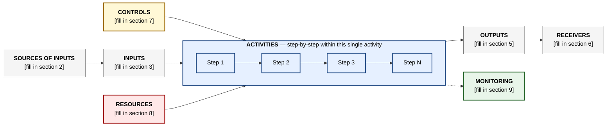

<!-- jb:project-callout -->
> Part of [[janus-puls-onboarding|Janus PULS Onboarding]] — automatically linked by /janus-brain.

# sub-process

> Part of [[janus-puls-onboarding|Janus PULS Onboarding]] — captured by /janus-brain.

_Extracted from `Documents/janus-puls-onboarding/skills/ims-enrolment/templates/sub-process.md` on 2026-05-14._

# [DEPARTMENT NAME] — Sub-Process: [ACTIVITY NAME]

**Activity Owner:** [Named person — required, may differ from department Process Owner]
**Parent process:** [Link to parent-process.md]
**Date drafted:** [YYYY-MM-DD]
**Status:** Draft v0.1 — pending Simon's review
**Maps to IMS process code:** [Simon assigns — leave blank]
**Related ISO clauses:** ISO 9001:2015 §[X] · ISO/IEC 27001:2022 §[X] · ISO/IEC 42001:2023 §[X]

---

## 0. About this document

This is the **sub-process document** for **[Activity Name]** — one of the activities listed in the [Department] parent process. It describes this single activity in detail using the ISO 9001:2015 Figure 1 schematic.

---

## 1. Process schematic — Figure 1

---

## 2. Sources of inputs (for this activity specifically)

> *Who/what triggers **this** activity? Usually inherited or narrowed from the parent process.*

| Type | Source |
|---|---|
| **Internal — predecessor activities** | [From within or outside this department] |
| **Internal — channels** | [Slack channels · meetings · ticketing systems] |
| **External — clients / vendors / regulators** | [Specific named parties] |

---

## 3. Inputs (for this activity)

| Category | Examples |
|---|---|
| **Triggers** | [What kicks off this specific activity?] |
| **Data** | [Information that enters the activity] |
| **Required artefacts** | [Documents · records · signed-off prior outputs] |

---

## 4. Activities — step by step

> *Break the activity into numbered steps. Each step has an owner and a control point on exit.*

| # | Step | Description | Owner | Control point on exit |
|---|---|---|---|---|
| 1 | [Step name] | [What happens in this step] | [Person / role] | [Gate that must pass before step 2 begins] |
| 2 | [Step name] | [What happens] | [Person / role] | [Exit gate] |
| 3 | [Step name] | [What happens] | [Person / role] | [Exit gate] |
| ... | ... | ... | ... | ... |

---

## 5. Outputs (of this activity)

| Output | Form | Receiver | Retention |
|---|---|---|---|
| [Output name] | [Form: document · record · service · decision] | [Who consumes it next] | [Where it lives · how long] |
| ... | ... | ... | ... |

---

## 6. Receivers of outputs

| Receiver | What they get |
|---|---|
| [Next process / department] | [What they receive] |
| [External party if applicable] | [What they receive] |

---

## 7. Controls and check points (specific to this activity)

| Stage | Control | Who decides |
|---|---|---|
| [Pre-activity] | [Entry criteria] | [Owner] |
| [Mid-activity] | [In-flight quality gate] | [Owner] |
| [Post-activity] | [Exit criteria · final review] | [Owner] |
| [Cross-cutting] | [Security · AI governance · data classification] | [Owner] |

---

## 8. Resources

| Resource | Detail |
|---|---|
| **Activity owner** | [Named person, accountable] |
| **Team members involved** | [Roles · headcount] |
| **Tools & systems** | [Software · AI tools · platforms] |
| **External services / vendors** | [If applicable] |
| **Knowledge required** | [Documentation · standards · training] |
| **Budget impact** | [Per-execution cost · monthly run rate] |

---

## 9. Monitoring & measurement (KPIs)

| KPI | Target | Source | Frequency |
|---|---|---|---|
| [KPI name] | [Target value] | [Where measured] | [Cadence] |
| ... | ... | ... | ... |

---

## 10. Open items for Simon (ISO Lead)

1. **[Open item]** — [decision needed] / [why blocking] / [who answers]
2. ...

---

## 11. Related documents

- **Parent process:** `parent-process.md`
- **Other sub-processes in this department:** `sub-process-[other-slug].md`
- **External references:** [[[linear|Linear]] AIR · Notion handover docs · [[github|GitHub]] repos]

---

## Change log

| Version | Date | Change | By |
|---|---|---|---|
| v0.1 | [YYYY-MM-DD] | Initial draft via `/ims-enrolment` Phase 3 interview | [Activity owner] |
